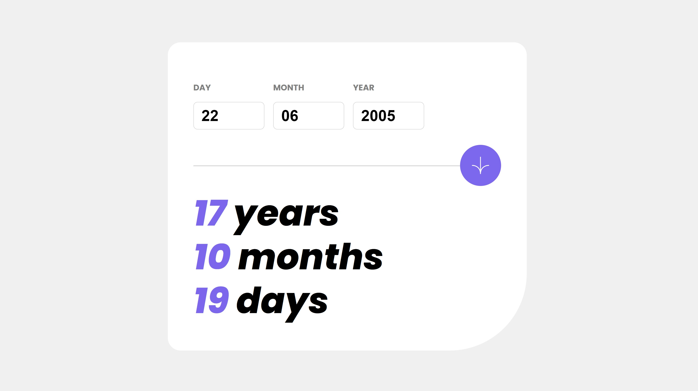

# Frontend Mentor - Age calculator app solution

This is a solution to the [Age calculator app challenge on Frontend Mentor](https://www.frontendmentor.io/challenges/age-calculator-app-dF9DFFpj-Q). Frontend Mentor challenges help you improve your coding skills by building realistic projects. 

## Table of contents

- [Overview](#overview)
  - [The challenge](#the-challenge)
  - [Screenshot](#screenshot)
  - [Links](#links)
- [My process](#my-process)
  - [Built with](#built-with)
  - [What I learned](#what-i-learned)
- [Author](#author)

**Note: Delete this note and update the table of contents based on what sections you keep.**

## Overview

### The challenge

Users should be able to:

- View an age in years, months, and days after submitting a valid date through the form
- Receive validation errors if:
  - Any field is empty when the form is submitted
  - The day number is not between 1-31
  - The month number is not between 1-12
  - The year is in the future
  - The date is invalid e.g. 31/04/1991 (there are 30 days in April)
- View the optimal layout for the interface depending on their device's screen size
- See hover and focus states for all interactive elements on the page

### Screenshot



### Links

- Live Site URL: [Github live service](https://mkab2000.github.io/Age-Calculator/)

## My process

### Built with

- Semantic HTML5 markup
- CSS custom properties
- Flexbox
- Mobile-first workflow


### What I learned

Learned how to embed custom fonts using css.

```css
@font-face { font-family: Poppins; src: url('assets/fonts/Poppins-Regular.ttf'); } 
@font-face { font-family: Poppins; font-style: italic; src: url('assets/fonts/Poppins-Regular.ttf'); } 
@font-face { font-family: Poppins; font-weight: bold; src: url('assets/fonts/Poppins-Bold.ttf');}
@font-face { font-family: Poppins; font-style: italic; font-weight: bold; src: url('assets/fonts/Poppins-BoldItalic.ttf');}
@font-face { font-family: Poppins; font-weight: 500; src: url('assets/fonts/Poppins-ExtraBold.ttf');}
@font-face { font-family: Poppins; font-style: italic; font-weight: 500; src: url('assets/fonts/Poppins-ExtraBoldItalic.ttf');}
```

Learned how to operate with Date objects

```js
  const date1 = new Date(curYear, curMonth, curDay);
  const date2 = new Date(year, month, day);
  const diff = new Date(date1.getTime() - date2.getTime());
  day = diff.getUTCDate() - 1;
  month = diff.getUTCMonth();
  year = diff.getUTCFullYear() - 1970;
  return [day, month, year];
```


## Author

- Website - [Miras Kabdygali](https://github.com/mkab2000)
- Frontend Mentor - [@miraskab](https://www.frontendmentor.io/profile/miraskab)
